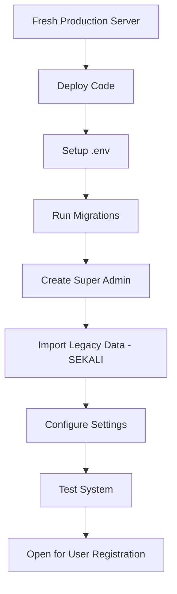

# 📦 Quick Guide: Import Data Legacy

## TL;DR

```bash
# Test dulu (recommended)
php artisan import:legacy-data --dry-run

# Import sebenar (run SEKALI sahaja)
php artisan import:legacy-data --force
```

---

## ❓ Soalan Lazim

### 1. Bila perlu import data legacy?

**SEKALI sahaja semasa setup production yang pertama kali.**

- ✅ Selepas migrate database
- ✅ Selepas create super admin
- ✅ Sebelum users mula register
- ❌ Jangan run berkali-kali (akan duplicate data)

### 2. Fail Excel apa yang diperlukan?

Pastikan 4 fail ini ada dalam root folder:

```
✓ Rekod Bayaran Yuran 2017-2024.xlsx
✓ Fail Yuran Tahunan dan Daftar Keahlian PPTT - sent to Marwelies 2 Sept 2022.xlsx
✓ Penyata Yuran 2024.xlsx
✓ Penyata Yuran 2025.xlsx
```

### 3. Data apa akan di-import?

| Data | Jumlah (approx) | Keterangan |
|------|-----------------|------------|
| **Houses** | ~150 | Semua rumah Jalan Tropika 2-5 |
| **Bills** | ~16,200 | 2017-2025 (9 tahun × 12 bulan × 150 rumah) |
| **Payments** | ~12,500 | Bills yang sudah dibayar |
| **Membership Fees** | ~150 | Yuran keahlian RM20 (2017) |

### 4. Berapa lama import?

**~15 minit** untuk dataset lengkap.

### 5. Adakah import automatic semasa production?

**TIDAK.** Import adalah:
- ✅ Manual command
- ✅ Run sekali sahaja
- ✅ Semasa setup awal
- ❌ Bukan automatic/scheduled

### 6. Bagaimana jika import gagal?

```bash
# Clear database dan cuba lagi
php artisan migrate:fresh
php artisan import:legacy-data --dry-run  # Test
php artisan import:legacy-data --force    # Import
```

### 7. Bagaimana verify import berjaya?

```bash
php artisan tinker
```

```php
// Check counts
House::count();           // Should be ~150
Bill::count();            // Should be ~16,200
Payment::count();         // Should be ~12,500

// Check financial summary
Bill::where('status', 'paid')->sum('amount');     // Total collected
Bill::where('status', 'unpaid')->sum('amount');   // Total outstanding
```

Atau check Admin Dashboard - semua data akan nampak.

### 8. User legacy boleh login terus?

**TIDAK.** Data legacy hanya payment history.

Users perlu:
1. Register akaun baru
2. Pilih rumah mereka
3. Tunggu approval admin
4. Selepas approved, mereka akan nampak:
   - ✅ Payment history legacy (2017-2025)
   - ✅ Current bills
   - ✅ Boleh bayar online

### 9. Command options apa yang ada?

```bash
# Dry run (test mode)
php artisan import:legacy-data --dry-run

# Force (skip confirmation)
php artisan import:legacy-data --force

# Skip specific imports
php artisan import:legacy-data --skip-houses
php artisan import:legacy-data --skip-bills
php artisan import:legacy-data --skip-membership

# Combine options
php artisan import:legacy-data --force --skip-membership
```

### 10. Apa yang berlaku pada data sedia ada?

Command akan **CLEAR** data berikut sebelum import:
- ❌ Houses
- ❌ Bills
- ❌ Payments
- ❌ Membership Fees
- ❌ Occupancies
- ❌ House Members

Command akan **PRESERVE** data berikut:
- ✅ Users
- ✅ Admin accounts
- ✅ System settings

---

## 🚀 Production Workflow



---

## 📊 Sample Output

```
==============================================
  LEGACY DATA IMPORT - Taman Tropika Kajang
==============================================

📂 Loading Excel files...
   Found 147 houses in valid streets (Jalan 2-5)

📊 IMPORT SUMMARY
─────────────────────────────────────────────
Item                          Count        Amount
─────────────────────────────────────────────
Houses to import              147          -
Total bills (2017-2025)       15,876       RM 158,760.00
Paid bills                    12,234       RM 122,340.00
Unpaid bills                  3,642        RM 36,420.00
Membership fees (paid)        118          RM 2,360.00
Membership fees (unpaid)      29           RM 580.00

Proceed with import? (yes/no) [no]:
> yes

🗑️  Clearing existing data...
   ✓ Cleared houses, bills, payments, membership fees
   ✓ Users and admin accounts preserved

⚙️  Creating fee configurations...
   ✓ Created legacy fee config (RM10/month, 2017-2025)
   ✓ Created current fee config (RM10/month, 2026+)

🏠 Importing houses...
 147/147 [▓▓▓▓▓▓▓▓▓▓▓▓▓▓▓▓▓▓▓▓▓▓▓▓▓▓▓▓] 100%
   ✓ Imported 147 houses

📄 Importing bills and payments (2017-2025)...
 15876/15876 [▓▓▓▓▓▓▓▓▓▓▓▓▓▓▓▓▓▓▓▓] 100%
   ✓ Created 15,876 bills
   ✓ Marked 12,234 bills as paid
   ✓ Created 12,234 payment records

🎫 Importing membership fees...
   ✓ Created 118 paid membership fees
   ✓ Created 29 unpaid membership fees

═══════════════════════════════════════════════
  ✅ IMPORT COMPLETED SUCCESSFULLY
═══════════════════════════════════════════════

Table                    Count
─────────────────────────────────
Houses                   147
Bills (Total)            15,876
Bills (Paid)             12,234
Bills (Unpaid)           3,642
Payments                 12,234
Membership Fees          147

💰 FINANCIAL SUMMARY
   Total Collected (Legacy): RM 122,340.00
   Total Outstanding: RM 36,420.00
```

---

## ⚠️ IMPORTANT NOTES

1. **Run SEKALI sahaja** - Jangan run berkali-kali
2. **Test dulu** - Gunakan `--dry-run` untuk verify data
3. **Backup dulu** - Backup database sebelum import (kalau ada data lain)
4. **Timing** - Import semasa setup awal sebelum users register
5. **Verify** - Check dashboard admin selepas import

---

## 📖 Full Documentation

Untuk panduan lengkap deployment, rujuk:
- `DEPLOYMENT_GUIDE.md` - Panduan deployment penuh
- `SYSTEM_SPEC_TAMAN_TROPIKA_KAJANG.md` - Spesifikasi sistem

---

**✅ READY TO IMPORT LEGACY DATA**

